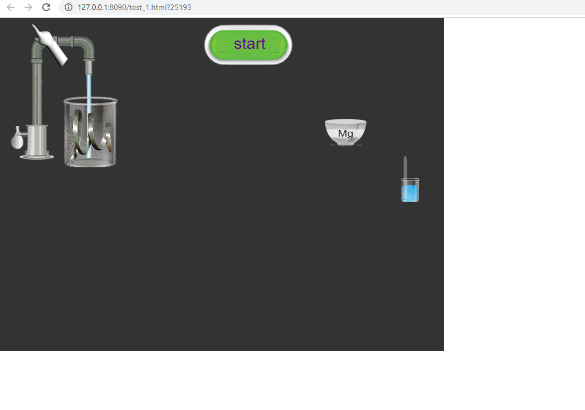
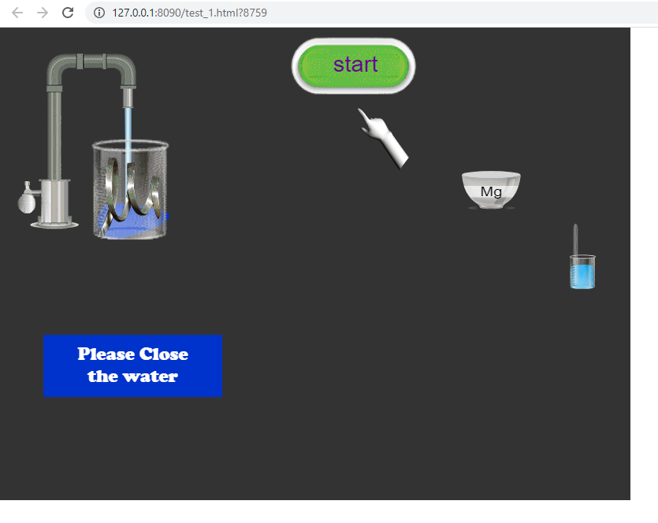

# my_first_animate This (HTML5)
Using adobe animate and JavaScript and createJS to create basics of science virtual lap  (I can handle any code)
to check last version clone this : final_animate.zip (1day learning only)

## final move: 
	

